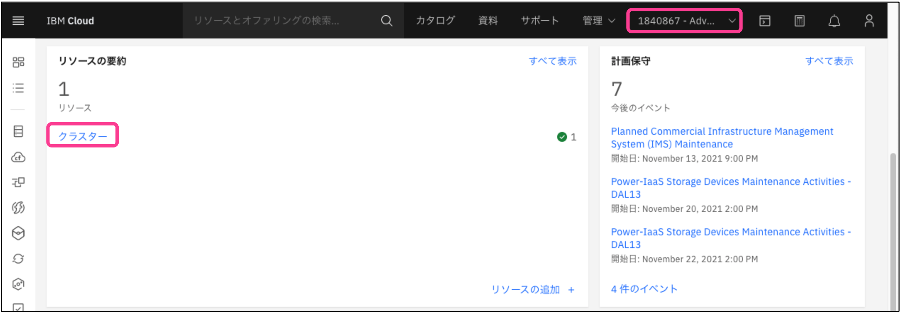
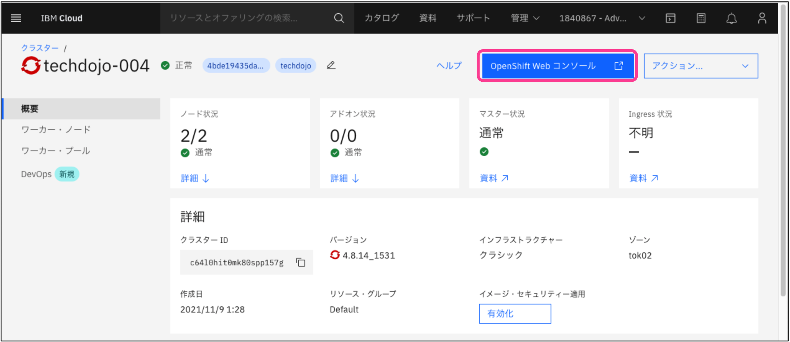

# ハンズオンワークショップ - 準備

## 0. 事前準備

1. [IBM Cloudライトアカウント作成](https://cloud.ibm.com/login) ※3分程度のビデオによるアカウント取得方法は[こちら](https://youtu.be/Krn1jQ4iy_s)で公開しています。
2. [GitHubアカウント作成](https://github.com/)(参考URL: [GitHubアカウントの作成方法 (2021年版)](https://qiita.com/ayatokura/items/9eabb7ae20752e6dc79d))

### 免責

本ハンズオンワークショップではOpenShiftのクラスタを利用します。
これは、みなさまのIBM Cloudのライトアカウントに、IBMが準備した作成済みOpenShiftクラスタを持つ**別のアカウントを紐付けた上でOpehShiftを利用します**。
ですので、こちらに記載の手順に従ってお試し頂く中では課金は一切発生いたしません。
ですが、従量課金制のIBM Cloudアカウント(PAYGやサブスクリプション)上にOpenShiftのクラスタを作成したり、有償のサービスを作成したりした場合は課金が発生いたします。
万が一、ご自身のIBM Cloudアカウント(PAYGやサブスクリプション)に対してクラスタを作成するなどして課金が発生した場合、IBM及び本ワークショップの講師は責任を負いかねますので、十分ご注意の上実施下さい。

## 1. OpenShift環境の準備
ワークショップ⽤のIBM Cloud環境にご⾃⾝のIBM Cloud IDを関連付けます。

注意事項
```
・ブラウザはFirefox, Chromeをご利⽤ください
・本ワークショップ⽤のIBM Cloud環境はセミナー開催時から24時間限定でお使いいただけます
```

### 1.1 下記URLにFirefoxブラウザでアクセス
ワークショップの場合 **講師よりアクセス先をご案内いたします**。下記はサンプルURLとなります。

https://xxxxxx.mybluemix.net/

### 1.2 ハンズオン環境へSubmit
[Lab Key] 、[Your IBMid]にご⾃⾝のIDを⼊⼒し、チェックボックスにチェックを⼊れて[Submit]をクリックします。


### 1.3 IBM Cloudダッシュボードの起動
Congratulations! が表⽰されたら、指定したIBMid宛に送られるメールを確認します。<br>
※必要に応じて、IBM Cloud (no-reply@cloud.ibm.com) からのメールを受信できるように、ご使用されているメーラー設定などを行ってください。<br>
メール本文にある[Join now.]のリンクをクリックします。


その後IBM Cloudへアカウントを紐付けるための画面が表示されるので、[アカウントに参加]ボタンをクリックします。


自動でIBM Cloudへログインされます。ログインされない場合は https://cloud.ibm.com へアクセスして手動でログインして下さい。

### 1.4 アカウントの切り替え
IBM Cloudダッシュボードにログインしたら、右上のアカウント情報の右横の「v」をクリックして、ワークショップ用のアカウントへ切り替えます。<br>
[1840867 – Advowork] のような「数字の羅列 - Advowork」がワークショップ用に準備されたアカウントです。 (数字部分は自動的に割り当てられます)<br>
※このアカウントは1日程度で無効になる一時的なアカウントです。


### 1.5 OpenShiftクラスタへのアクセス
IBM Cloudダッシュボードの右上のアカウント情報が変更されたことを確認し、[リソースの要約]の[Clusters]をクリックします。


Clustersの下のクラスター名をクリックします。 (クラスター名は⾃動的に割り当てられます)


### 1.6 OpenShift Webコンソールの起動
[OpenShift Webコンソール]ボタンをクリックします。<br>
※ポップアップが制御されていると動作しませんので解除してください。


新しいウィンドウ（またはタブ）でOpenShiftのコンソールが開けばOKです。アクセスするURLはポート30000番台（⾃動で割り当てられます）を使っているので、社内プロキシなどで制限している場合はポートを開いておいてください。<br>
Webコンソールは、通常以下のようなURLでリダイレクトされます。
```https://c100-e.jp-tok.containers.cloud.ibm.com:31379/```


これでOpenShiftワークショップの環境準備は完了です。
