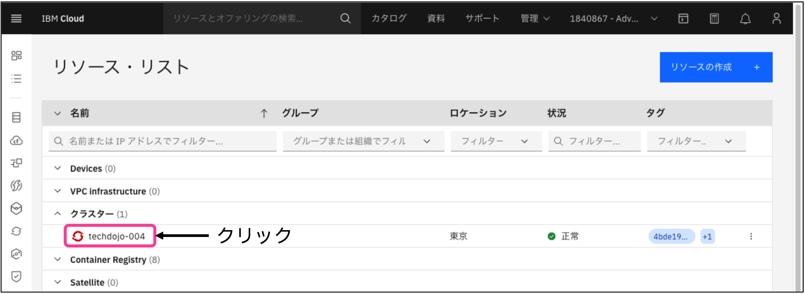
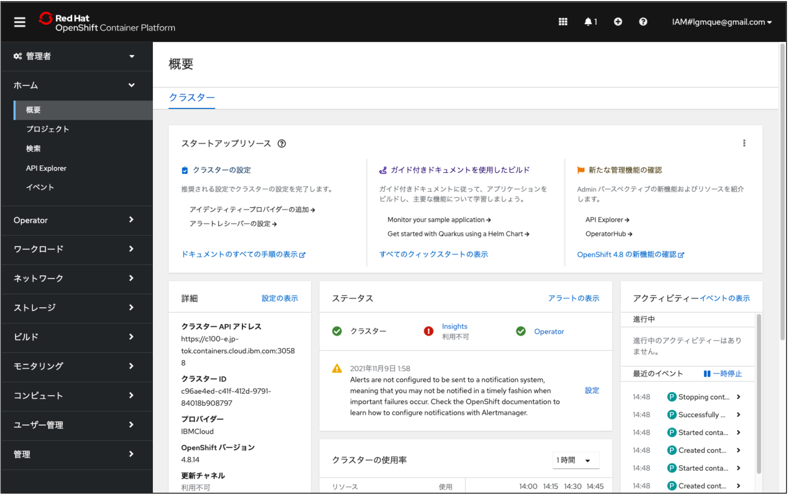

## 事前準備
1. IBM Cloudライトアカウント作成
2. GitHubアカウント作成

## OpenShiftへのいろいろな入力パターン


本ハンズオンワークショップではこの中からSource to Image (S2I) を試します。


## ハンズオンワークショップの流れ
1. OpenShift環境の準備
2. ソースコードのFork
3. アプリのDeploy
4. Webhookの設定
5. ソースコードの修正及びDeploy(⾃動）

## 1. OpenShift環境の準備
ワークショップ⽤のIBM Cloud環境にご⾃⾝のIBM Cloud IDを関連付けます。

注意事項
```
・ブラウザはFirefox, Chromeをご利⽤ください
・本ワークショップ⽤のIBM Cloud環境はセミナー開催時から24時間限定でお使いいただけます
```

### 1.1 下記URLにFirefoxブラウザでアクセス
https://openshiftdojo.mybluemix.net/

### 1.2 ハンズオン環境へSubmit
[Lab Key] 、[Your IBMid]にご⾃⾝のIDを⼊⼒し、チェックボックスにチェックを⼊れて[Submit]をクリックします。


### 1.3 IBM Cloudダッシュボードの起動
Congratulations! が表⽰されたら[1. Log in IBM Cloud]リンクをクリックします。


### 1.4 アカウントの切り替え
IBM Cloudダッシュボードの右上のアカウント情報の右横の「v」をクリックして、ワークショップ用のアカウントへ切り替えます。<br>
[1840867 – Advowork] のような「数字の羅列 - Advowork」がワークショップ用に準備されたアカウントです。 (数字部分は自動的に割り当てられます)<br>
※このアカウントは1日程度で無効になる一時的なアカウントです。


### 1.5 OpenShiftクラスタへのアクセス
IBM Cloudダッシュボードの右上のアカウント情報が変更されたことを確認し、[リソースの要約]の[Clusters]をクリックします。


Clustersの下のクラスター名をクリックします。 (クラスター名は⾃動的に割り当てられます)


### 1.6 OpenShift Webコンソールの起動
[OpenShift Webコンソール]ボタンをクリックします。<br>
※ポップアップが制御されていると動作しませんので解除してください。


新しいウィンドウ（またはタブ）でOpenShiftのコンソールが開けばOKです。アクセスするURLはポート30000番台（⾃動で割り当てられます）を使っているので、社内プロキシなどで制限している場合はポートを開いておいてください。<br>
Webコンソールは、通常以下のようなURLでリダイレクトされます。
```https://c100-e.jp-tok.containers.cloud.ibm.com:31379/```


これでOpenShiftワークショップの環境準備は完了です。

## 2. ソースコードのFork
ここからはGitHubへアクセスして自分のリポジトリへサンプルソースコードをForkしていきます。

### 2.1 GitHubへのサインイン
GitHubにサインイン(Sign in)してください。まだアカウント登録されていない方は[こちら](https://github.com/)からサインアップ(Sign up)してください。<br>


### 2.2 リポジトリーのFork
ブラウザーで[https://github.com/osonoi/node-build-config-openshift](https://github.com/osonoi/node-build-config-openshift)を開いてください。<br>
[Fork]ボタンをクリックして、自分のアカウントを選択してください。


### 2.3 自分のリポジトリーの確認
Forkする際に指定した自分のリポジトリーへ、対象のプロジェクトがForkされたことを確認します。<br>
リポジトリーのパスの最初の部分が自分のGitHubアカウントになっていればOKです。


