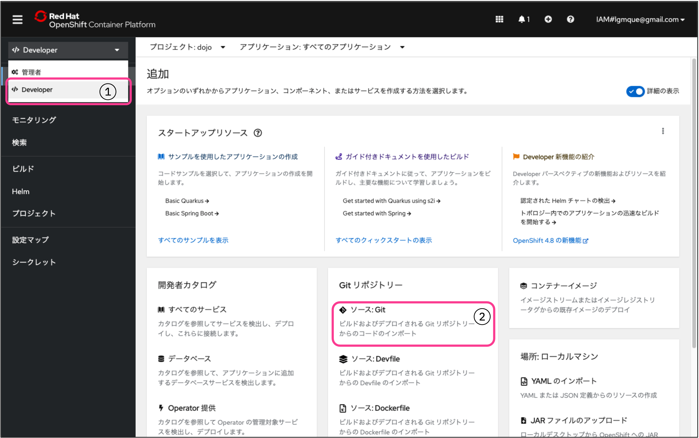
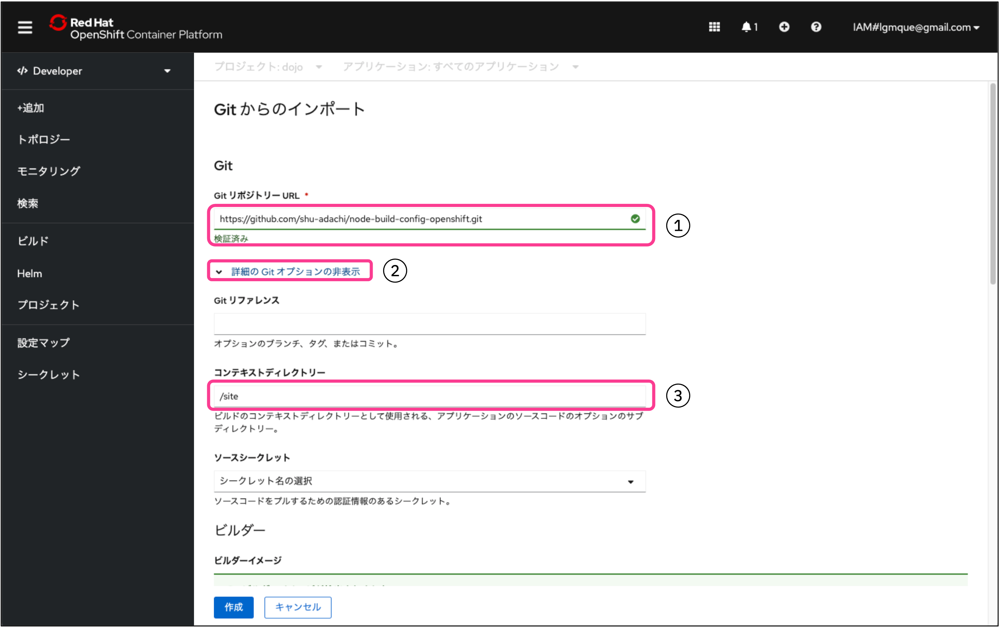
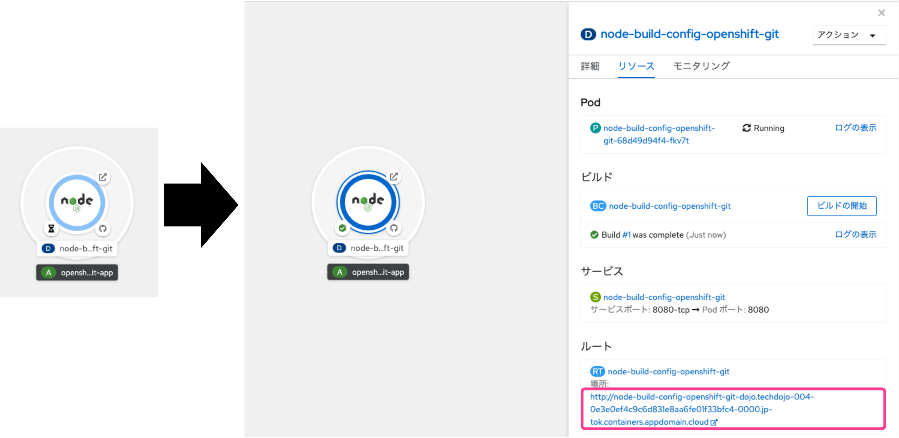
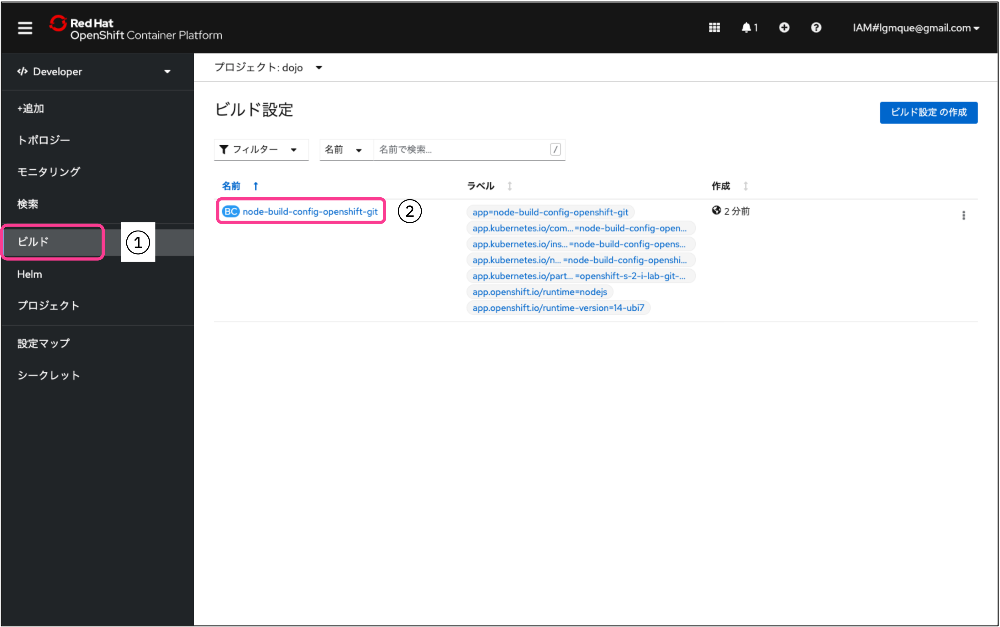
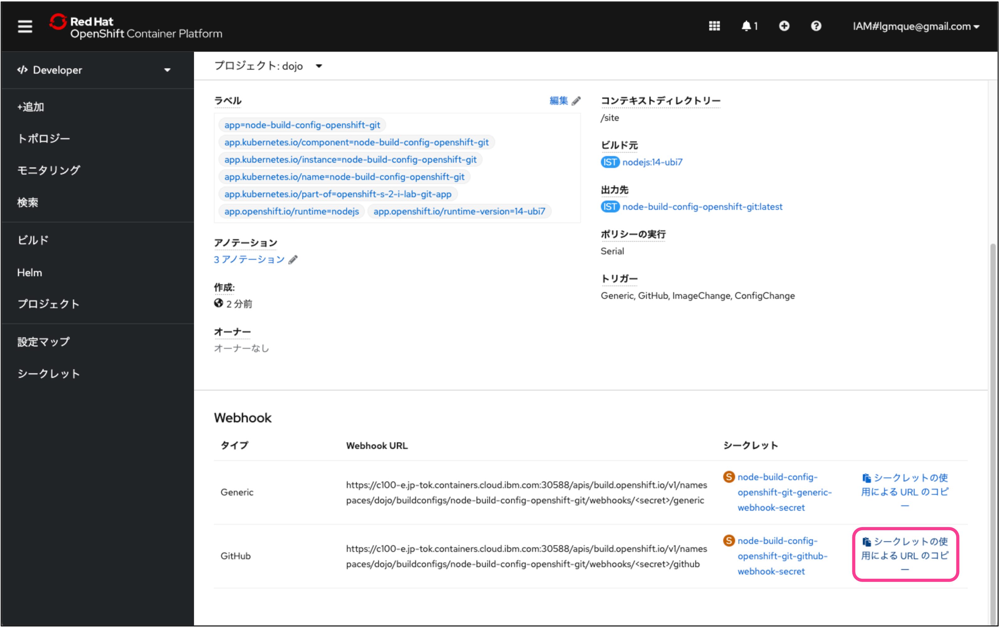
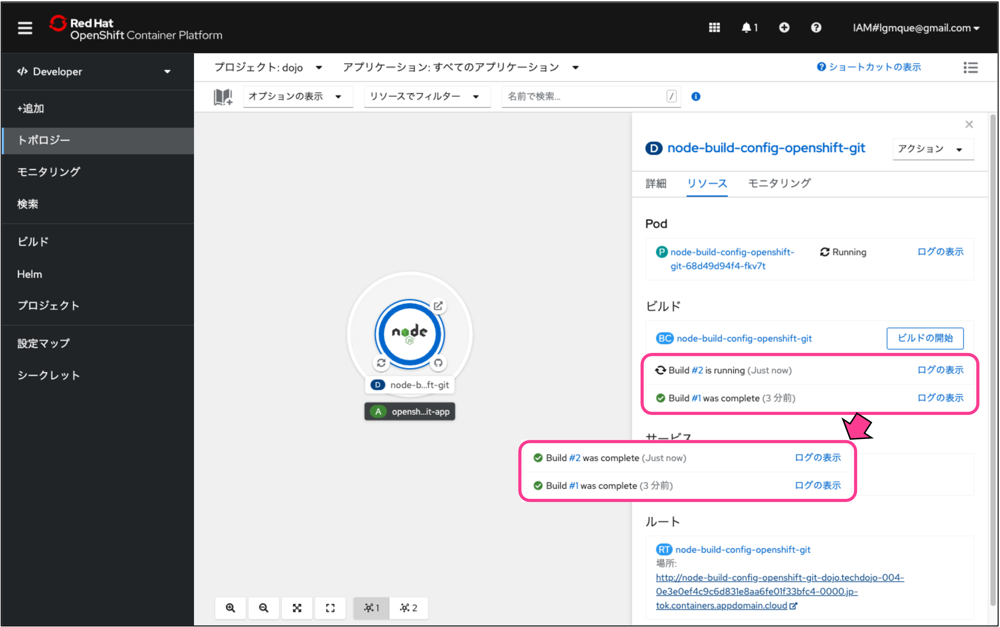

## 0. 事前準備
1. [GitHubアカウント作成](https://github.com/)(参考URL: [GitHubアカウントの作成方法 (2021年版)](https://qiita.com/ayatokura/items/9eabb7ae20752e6dc79d))</br>
(OpenShift Localを使って本ハンズオンを実施する方は2.以降の手順も実施してください。)
2. OpenShift Local のインストール、もしくは Developer Sandbox for Red Hat OpenShift環境にてクラスタを起動
3. (OpenShift Localを導入された方のみ) UltraHookの導入 ※[こちらの1. 環境構築](https://qiita.com/LgmQue/items/3db2456bdcb33d7d2edc#1-%E7%92%B0%E5%A2%83%E6%A7%8B%E7%AF%89)を参照してください。

### 免責
本ハンズオンワークショップではOpenShiftのクラスタを利用します。
万が一、ご自身のIBM Cloudアカウント(PAYGやサブスクリプション)に対してクラスタを作成するなどして課金が発生した場合、IBM及び本ワークショップの講師は責任を負いかねますので、十分ご注意の上実施下さい。

### OpenShiftへのいろいろな入力パターン


本ハンズオンワークショップではこの中からSource to Image (S2I) を試します。


### ハンズオンワークショップの流れ
1. OpenShift Localの起動
2. ソースコードのFork
3. アプリケーションのDeploy
4. Webhookの設定
5. ソースコードの修正及びDeploy(⾃動）

## 1. OpenShift Localの起動
注意事項
```
・ブラウザはFirefox, Chromeをご利⽤ください
```


タスクバーから、Openshift Local のアイコンを右クリックし、[start]をクリックしてください。起動したら[running]にステータスが変わります。


[Open Console]をクリックし、OpenShift Local のコンソールを開きます。<br>
ログインユーザがdeveloperの場合は、右上の[developer]をクリックし、管理者に変更します。


コマンドで起動する場合

コマンドプロンプト、あるいはPowerShellを立ち上げて、以下コマンドを実行します。<br>
※管理者権限ではなく、ローカルユーザにて実行<br>
```cmd
crc start
```
コンソールを立ち上げるには、[Copy OC login command(admin)]をクリックし、コマンドを貼り付けて実行します。


## 2. ソースコードのFork
ここからはGitHubへアクセスして自分のリポジトリへサンプルソースコードをForkしていきます。

### 2.1 GitHubへのサインイン
GitHubにサインイン(Sign in)してください。まだアカウント登録されていない方は[こちら](https://github.com/)からサインアップ(Sign up)してください。<br>


### 2.2 リポジトリーのFork
ブラウザーで[https://github.com/osonoi/node-build-config-openshift](https://github.com/osonoi/node-build-config-openshift)を開いてください。<br>
[Fork]ボタンをクリックして、自分のアカウントを選択してください。


### 2.3 自分のリポジトリーの確認
Forkする際に指定した自分のリポジトリーへ、対象のプロジェクトがForkされたことを確認します。<br>
リポジトリーのパスの最初の部分が自分のGitHubアカウントになっていればOKです。


## 3. アプリケーションのDeploy
ここからは、先程用意したOpenShiftの環境へ、自分のGitHubリポジトリーにあるアプリケーションをデプロイします。

### 3.1 OpenShift Projectの作成
OpenShiftのWebコンソールへ戻り、[プロジェクト]ボタンをクリックします。<br>
その後[プロジェクトの作成]ボタンをクリックするとプロジェクトの作成画面が開きますので、任意のプロジェクト名を入力し[作成]ボタンをクリックしてください。<br>なお、名前にはすべて小文字をお使いください。


### 3.2 OpenShiftユーザータイプの切り替え
左上のメニューにて、[管理者]から[Developer]に切り替えます。<br>
切り替えたら[ソース:Git]をクリックしてください。


### 3.3 デプロイするアプリケーションのソースコードを指定
先ほどコピーした、自分のGitHubリポジトリーのURLを[GitリポジトリーURL]に入力します。<br>
下の[詳細のGitオプションの表示]をクリックすると入力エリアが展開するので、[コンテキストディレクトリー]に「/site」と入力してください。<br>
今回デプロイする対象のアプリケーションはGitHubリポジトリー[node-build-config-openshift]の「site」ディレクトリ配下のため、ここでディレクトリを指定します。


### 3.4 デプロイするアプリケーションのタイプを選択
言語やタイプの一覧がタイルで表示され、Node.jsが選択されていることを確認します。今回GitHubリポジトリーへForkしたプロジェクトはNode.jsアプリケーションだからです。<br>
選択したら最下段の[作成]ボタンをクリックしてください。（他のオプションはすべてデフォルトで構いません)


### 3.5 アプリケーションのデプロイ
アプリケーションのデプロイが始まります。1分弱お待ちください。中の丸が青くなったら完成です。丸の中をクリックすると右側にメニューが出てくるので[リソース]タブの[ルート]の下のURLをクリックするとWebへ公開されたアプリケーションへアクセスできます。


### 3.6 アプリケーションへのアクセス
デプロイされ、Webへ公開されたアプリケーションへアクセスできました。<br>
実際にこのアプリケーションへログインしてみましょう。ID,Passwordともに「test」と入れてログインしてください。<br>
医療関連のデータを管理するサンプルアプリケーションへログインできたかと思います。


ここまでで、GitHub上のソースコードをダイレクトにOpenShiftへデプロイする方法を学びました。


## 4. Webhookの設定
ここでは、GitHub上のソースコードが変更された際に、自動的にOpenShiftへデプロイされるようにWebhookをGitHub上へ設定していきたいと思います。

OpenShift、もしくはDeveloper Sandboxを使っている方は4.1, OpenShift Localを使っている方は4.2の手順を実施してください。

<details>
<summary>4.1 OpenShift(Developer Sandbox)</summary>

### 4.1.1　OpenShiftのWebhook URLの取得
OpenShiftのWebコンソールへアクセスします。左側のメニューから[ビルド]を選択し、右側のワークスペースに表示される[node-build-config-openshift]をクリックします。


下にスクロールして一番右の[シークレットの使用によるURLのコピー]をクリックしてWebhookのURLとSecretをクリップボードにコピーしてください。


### 4.1.2 GitHubにWebhookを設定
GitHubの自分のリポジトリーへ戻り、[Settings] -> [Webhooks] -> [Add webhook]を選択します。


先ほどクリップボードにコピーしたURL+secretを[Payload URL]に貼り付けてください。[Control type]は[application/json]を選択してください。


入力後、[Add webhook]を選択します。<br>
以下の図の様に緑のチェックマークが付いたら設定成功です。（チェックマークが表示されない場合はページを再読み込みしてください。）

</details>


<details>
<summary>4.2 OpenShift Local</summary>

### 4.2.1 UltraHookの設定
[こちらの2. UltraHookの設定](https://qiita.com/LgmQue/items/3db2456bdcb33d7d2edc#2-ultrahook%E3%81%AE%E8%A8%AD%E5%AE%9A)を実施してください。<br>
hint: namespaceは一意である必要があります。「dojo自分の名前今日の日付」(例:dojotestuser20221224)などにしてください。

### 4.2.2　UltraHookの起動
[こちらの3. UltraHookの起動](https://qiita.com/LgmQue/items/3db2456bdcb33d7d2edc#3-ultrahook%E3%81%AE%E8%B5%B7%E5%8B%95)を実施してください。

OpenShiftのWebhook URLはWebコンソールへアクセスし、左側のメニューから[ビルド]を選択し、右側のワークスペースに表示される[node-build-config-openshift]をクリックし


下にスクロールして一番右の[シークレットの使用によるURLのコピー]をクリックするとWebhookのURLとSecretをクリップボードにコピーができます。


UltraHookが起動できたら、GitHubの自分のリポジトリーへ戻り、[Settings] -> [Webhooks] -> [Add webhook]を選択します。


[3. UltraHookの起動](https://qiita.com/LgmQue/items/3db2456bdcb33d7d2edc#3-ultrahook%E3%81%AE%E8%B5%B7%E5%8B%95)で取得したURLを[Payload URL]に貼り付けてください。[Control type]は[application/json]を選択してください。


入力後、[Add webhook]を選択します。<br>
以下の図の様に緑のチェックマークが付いたら設定成功です。（チェックマークが表示されない場合はページを再読み込みしてください。）

</details>

これでwebhookの設定は完了です。後はソースコードの修正で自動的にアプリケーションがデプロイされます。


## 5. ソースコードの修正及びDeploy(自動)
最後に、GitHub上のソースコードを修正し、それが自動でOpenShiftへ反映されることを試していきます。

### 5.1 ソースコードの修正
GitHubの自分のリポジトリ画面から[Site]フォルダーを選択します。


[public]フォルダ配下の[index.html]を選択しペンのアイコンをクリックして編集モードにします。<br>
ここでは、GitHubのGUIから編集を行いますが、ローカルにcloneして編集したファイルをcommit、pushしてもOKです。


変更点をクイックに確認するために、ここでは23行目の英文「Example Health」を日本語の「医療管理」に変更してみます。<br>
変更したらコミットしてください。自分所有のリポジトリーなので、そのまま反映されます。


OpenShiftのWebコンソールへ戻り、左側の[トポロジー]を確認すると、再度デプロイがおこなわれていることが分かります。


再デプロイが完了したらデプロイしたアプリケーションを起動し直してください。（既に表示されている場合はリロードしてください）<br>
アプリケーション内にある見出しが「Example Health」から「医療管理」に変更されたことが確認できました。


お疲れさまでした！これで、OpenShiftのS2Iを使ったハンズオンワークショップは完了です。


## その他のアプリケーション
もし、PHPのサンプルアプリケーションで試してみたい方は下記のリポジトリーのソースコードを試してみてください。
[https://github.com/osonoi/php-s2i-openshift](https://github.com/osonoi/php-s2i-openshift)


